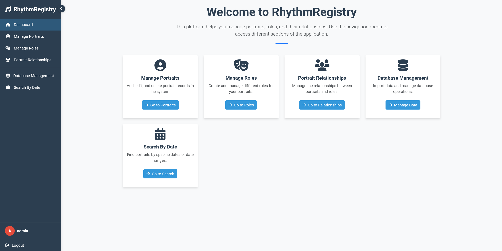

# Rhythm Registry

## Overview

**Rhythm Registry** is a Flask-based web application designed for cataloging artists, performers, and their professional roles. Built with a modular structure and responsive interface, it offers a powerful toolset for organizing biographical records and affiliations with precision and ease.

Users can manage detailed portrait entries, associate them with multiple creative roles (e.g. actor, singer), and import enriched data from external sources like Wikipedia.

**[Click here to watch the demo video](https://youtu.be/TdXgn9y5ZD0)**

<div align="center">
  
</div>
<p align="center">
  <em>Main dashboard interface</em>
</p>

## Features
- **Portrait Management**: Add, edit, and remove portraits with detailed biographical data  
- **Role System**: Create and manage roles linked to artists and public figures  
- **Many-to-Many Relationships**: Associate a single portrait with multiple roles  
- **Wikipedia Integration**: Import portrait information from Wikipedia based on specific dates  
- **Search Tools**: Search across names, dates, and associated roles  
- **Authentication**: Secure login and registration system  
- **Responsive UI**: Adapts smoothly to mobile, tablet, and desktop displays  
- **PostgreSQL Tools**: Utilities for database creation and maintenance

## Installation

### Prerequisites

To install and run Rhythm Registry, ensure the following are available:

- **Python** 3.x  
- **PostgreSQL** database  

### Setup

1. Clone the repository and navigate into the project directory:
```bash
git clone https://github.com/Nightdragon2000/RhythmRegistry.git
cd RhythmRegistry
```

2. Create and activate a virtual environment:
```bash
python -m venv venv
venv\Scripts\activate
```
3. Install the required dependencies:
```bash
pip install -r requirements.txt
```

4. Initialize the database:
```bash
python setup_database.py
```

### Running the Application
To start the application, run:
```bash
python src/run.py
```

Once running, the system will be accessible at:  
[`http://localhost:5002`](http://localhost:5002)


## System Architecture
- **Framework**: Flask  
- **Database Layer**: SQLAlchemy (PostgreSQL)  
- **Templating**: Jinja2  
- **Frontend**: Bootstrap  
- **Additional Tools**:
  - ReportLab *(for PDF generation)*  
  - Beautiful Soup *(for Wikipedia data scraping)*
